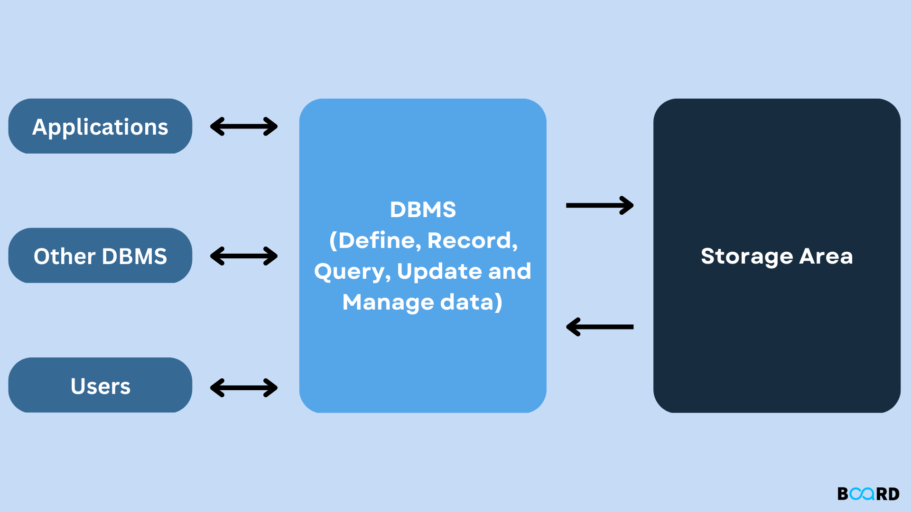
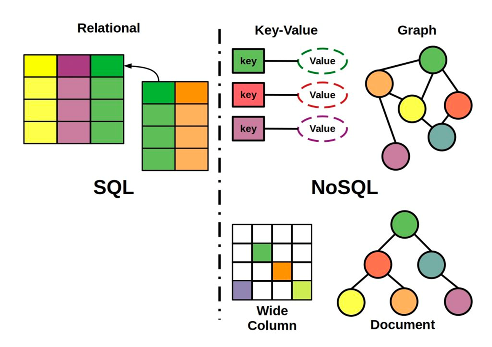
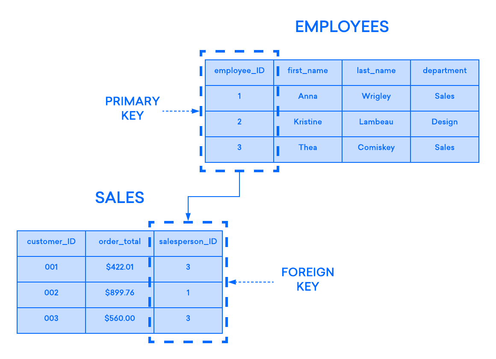
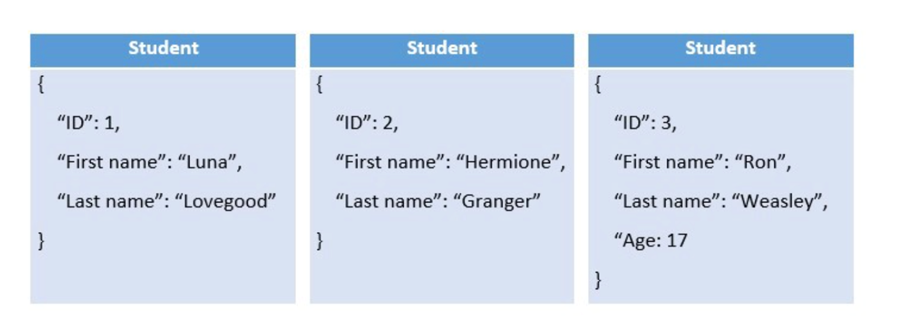
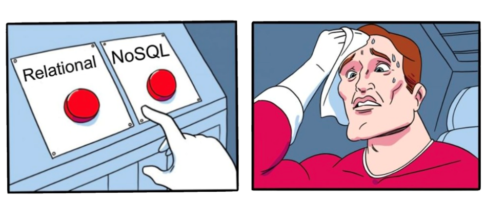
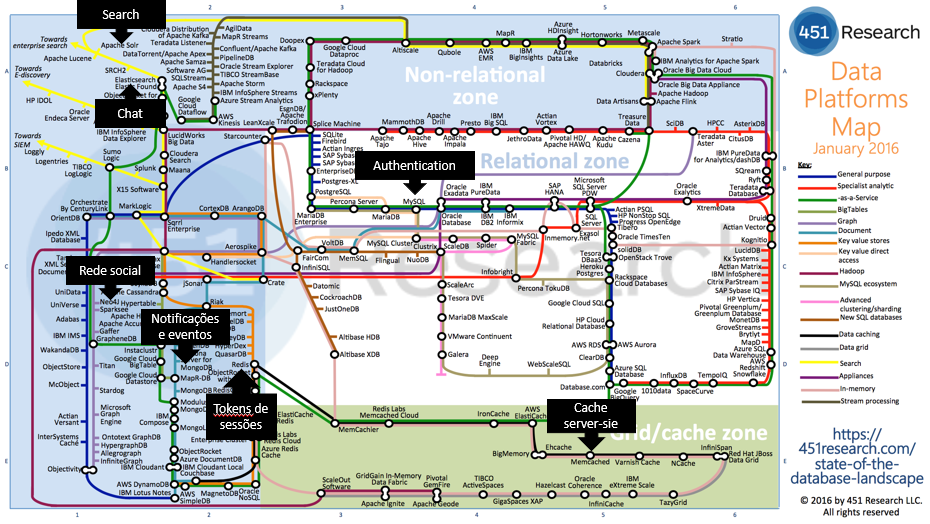

# Indroduction to databases

## What is a database?

A database is a collection of information that is organized so that it can be easily accessed, managed, and updated. It serves as a structured repository for storing and retrieving data. Databases can be classified into different types based on the nature of the content they hold, such as bibliographic, full-text, numeric, and images.
Databases exist on the phyical world and on the digital world. For example, a library has a database of books, a company has a database of employees, and a school has a database of students.


A library is an example of a real-world database. It typically has a database of books, where information such as book titles, authors, and availability are stored and managed.

## What is a database management system (DBMS)?



In the context of websites and applications, when people refer to a “database” they’re often talking about a computer program that allows them to interact with their database. These programs, known more formally as a database management system (DBMS).

A database management system (DBMS) is system software for creating and managing databases. The DBMS provides users and programmers with a systematic way to create, retrieve, update and manage data.

Examples of DBMS:
- [MySQL](https://www.mysql.com/)
- [PostgreSQL](https://www.postgresql.org/)
- [MongoDB](https://www.mongodb.com/)
- [Neo4j](https://neo4j.com/)


### How do we interact with a DBMS?

The DBMS accepts requests for data from an application program and instructs the operating system to transfer the appropriate data. The DBMS receives the data from the operating system and instructs it to transfer the data to the application.

Example of a simple interaction with a DBMS (using SQL):

```sql
SELECT * FROM employees WHERE salary > 50000;
```

In this example, the DBMS is instructed to retrieve all the records from the employees table where the salary is greater than 50000.


## What is a database model?

A database model is a type of data model that determines the logical structure of a database and fundamentally determines in which manner data can be stored, organized, and manipulated.

### Types of database models in web development:





### Relational databases

Relational databases are a cornerstone of traditional database management systems, characterized by their structured approach to organizing data. At the heart of a relational database is the relational model, which was introduced by Edgar F. Codd in 1970. This model organizes data into one or more tables (or "relations") of rows and columns, with a unique key identifying each row. Rows in the table represent data entries, and columns represent the attributes of the data.



### NoSQL databases

A NoSQL (originally referring to "non SQL" or "non relational") database provides a mechanism for storage and retrieval of data that is modeled in means other than the tabular relations used in relational databases. Actually the term "non SQL" has been redefined to "not only SQL" to emphasize that they may support SQL-like query languages even though they may not be SQL-based.


#### Common types of NoSQL databases include:

##### Document databases

A document-oriented database, or document store, is a computer program and data storage system designed for storing, retrieving, and managing document-oriented information, also known as semi-structured data.
This type of database adds the concept of a document, which encapsulates and stores data in a standard format such as JSON or XML. Each document contains one or more fields, including arrays, binary data, or sub-documents. Fields can vary from document to document, and the data structure can be changed over time.

Example: MongoDB



##### Key-value databases

A key-value database, or key-value store, is a data storage paradigm designed for storing, retrieving, and managing associative arrays, and a data structure more commonly known today as a dictionary or hash table.
This type of databases are commonly used for caching, session management, and real-time analytics. They are also used in applications that require high-speed data access.

Example: Redis

##### Graph databases

A graph database is a database that uses graph structures for semantic queries with nodes, edges, and properties to represent and store data. A key concept of the system is the graph (or edge or relationship), which directly relates data items in the store. The relationships allow data in the store to be linked together directly, and in many cases retrieved with one operation.
This type of database is well-suited for applications that require complex queries and deep relationships between data entities.

Example: Neo4j

##### Columnar databases

A columnar database is a database management system (DBMS) that stores data in columns rather than in rows.
This type of database is designed to efficiently store and retrieve data for data warehousing and analytics applications. It is particularly well-suited for read-heavy workloads, such as business intelligence and data warehousing.

Example: Cassandra

### Choosing the right database model

Very often, the choice of a database model is not a simple one. It might depend on the nature of the data, the requirements of the application, and the **skills of the development team**.



Dispite the fact that NoSQL databases are gaining popularity, relational databases are still the most widely used database model. This is because they are well-established, and the skills to work with them are widely available. However, NoSQL databases are gaining popularity because they are often more scalable and flexible than relational databases.

Each type of database model has its own strengths and weaknesses, and the choice of a database model should be made based on the specific requirements of the application and again the knowledge of the development team as in the end, the database model is just a tool to solve a problem.


### The Campus by Fundação Altice example

Campus by Fundação Altice is a social web application that allows students to connect with each other. As it's social nature, it has different types of features like user profiles, posts, comments, favorites, chat, images, and videos:


#### What dabase model would you choose for Campus?

As Campus by Fundação Altice has the social nature and different kinds of features and requirements, it ended up using different databases in order to solve different problems:

- Social nature of the application - Graph database (Neo4j) - to solve the complex relationships between users network and the posts, comments, favorites, ...

- Authentication and user profiles - Relational database (MySQL) - to solve the structured nature of the user profiles and the authentication process.

- Chat - Elasticsearch - to solve the real-time nature of the chat and the search of messages efficiently.

- Notifications - MongoDB - to solve the semi-structured nature of the notifications and the real-time nature of the notifications.

- Session tokens - Redis - as the session tokens are a non sensitive information that expires after a short period of time and needs to be accessed quickly.




