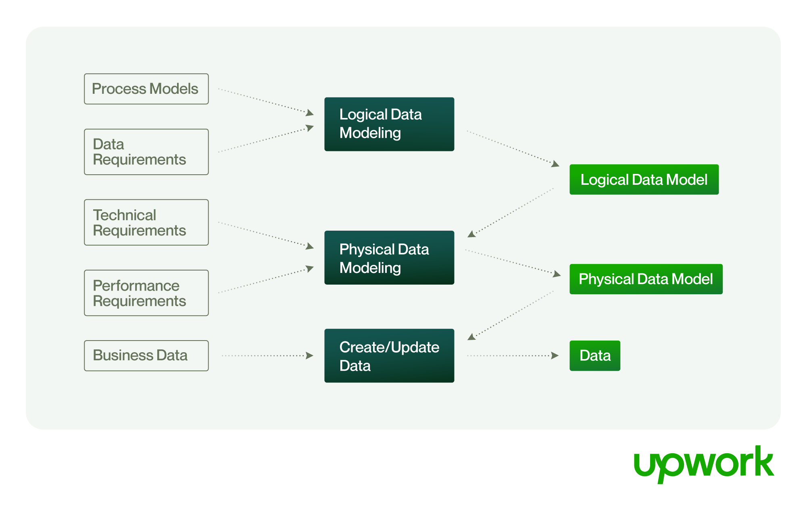
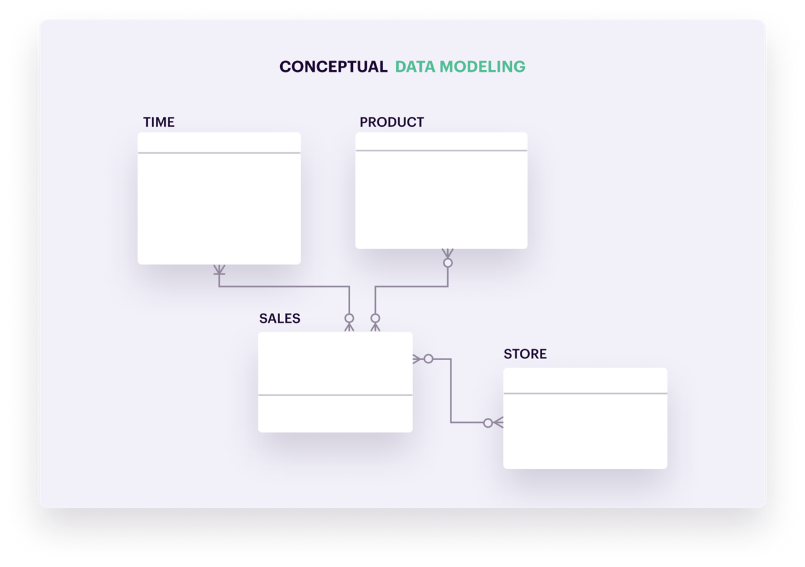
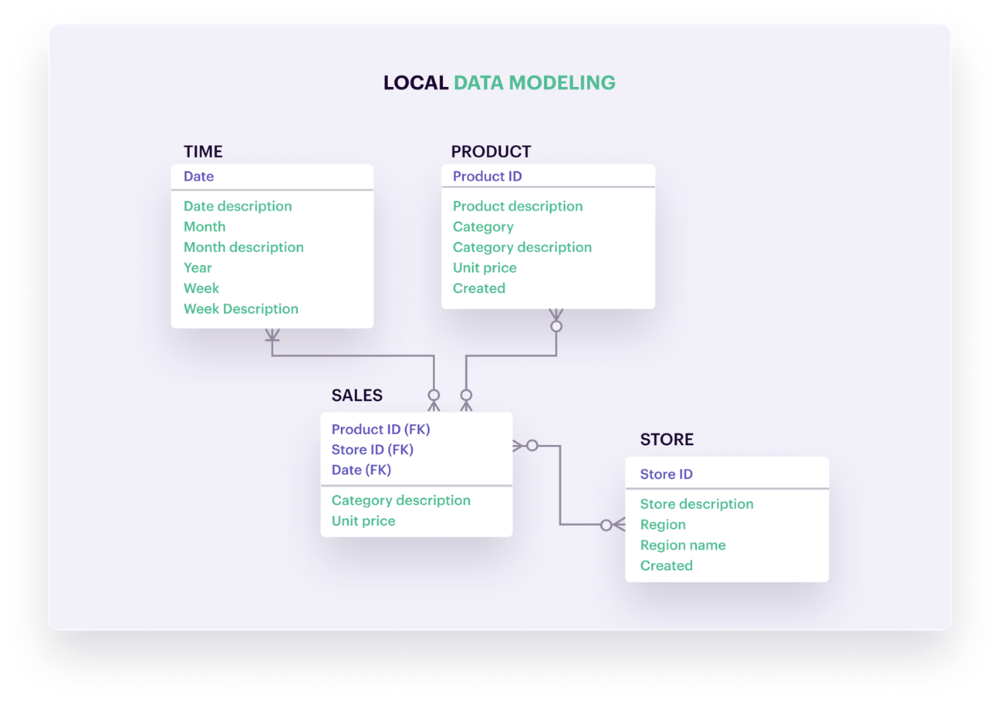
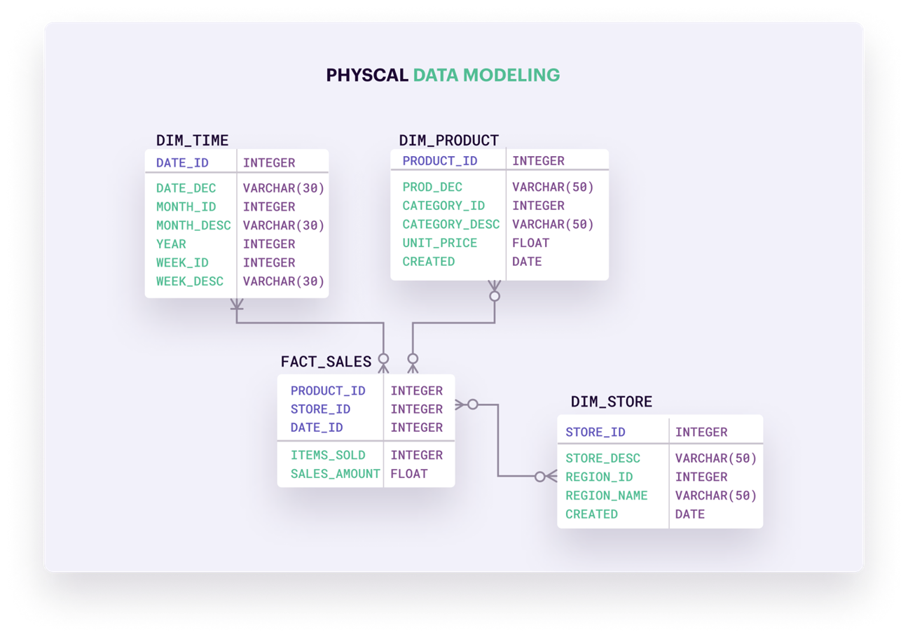
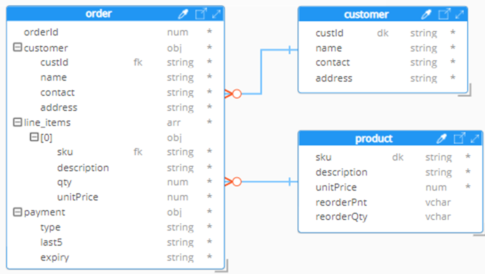
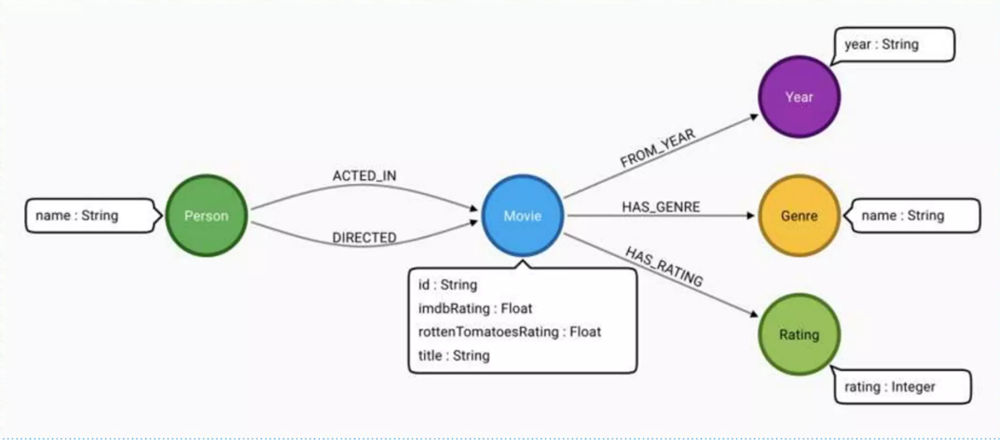

# Small guide for data modeling

## What is Data Modeling?

Data model is the process of turning your application features and requirements into a database properly schema. Data models provide a blueprint for designing a new database or reengineering a legacy application. Overall, data modeling helps an organization use its data effectively to meet business needs for information.

## Why is Data Modeling important?

The essence of data modeling lies in its capacity to elucidate data attributes, their interconnections, and the overarching structure. It plays a crucial role in demystifying business operations and the informational prerequisites of the application. Through data modeling, critical data requirements are identified and strategized for optimal organization.

Data modeling makes it easier for developers, data architects, business analysts, and other stakeholders to view and understand relationships among the data in a database. In addition, it can:

- Reduce errors in software and database development.
- Improve application and database performance.
- Ease in Data Analysis and Decision Making
- Better Data Integrity and Consistency
- Ease and speed the process of database design at the conceptual, logical and physical levels.

## Steps to Data Modeling

### Conceptual Data Model

The conceptual data model identifies the highest-level relationships between different entities. It is a high-level data model that defines what the system contains. It is independent of hardware or software constraints. It is a representation of organizational data requirements at a high level that is independent of the database management system (DBMS) that will be used to implement the database.

Some developers skip this step and go directly to the logical data model, but it is important to understand the business requirements and the entities that will be part of the database. Going directly to the logical data model can lead to a database that **does not meet the business requirements**. Or, sometimes, it might lead to an over-engineered database that is too complex for the business requirements that might often be simple.

### Logical Data Model

The logical data model is a detailed version of the conceptual data model. It is a high-level data model that is independent of the database management system and other physical considerations. It is a representation of the data that is independent of any application that will use the data. The logical data model is used to define the structure of the data elements and to set relationships between them.

### Physical Data Model

The physical data model is a detailed version of the logical data model. It is a low-level data model that is used to organize data on a storage medium. It defines the logical structure of the database and provides the basis for the development of the physical database. It is a representation of the data that is used in the database and that is independent of the database management system.

Depending on the type of the database the physical data model can be different. For example, for a relational database, the physical data model is a representation of the actual database. For a NoSQL database, the physical data model is a representation of the data that is used in the database and that is independent of the database management system.

#### Relational Database

#### Document Database

#### Graph Database

