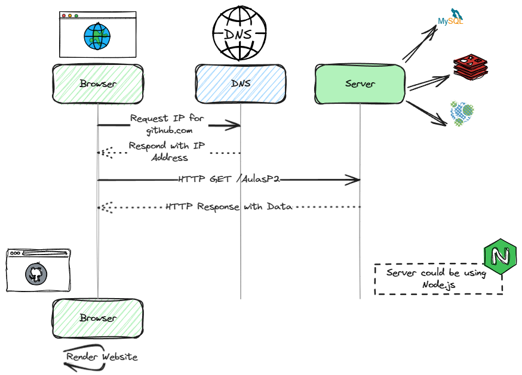

# Server side 

## What happens when I access a website?

Whenever you visit a website, your browser sends a request to the server where the website is hosted. The server then processes the request and sends back the requested information to your browser.
This process uses the **HTTP** (Hypertext Transfer Protocol) protocol, which is a set of rules that allows the transfer of files, such as text, images, and videos, on the web.


## Steps when accessing a website

### **DNS resolution**: 

Your browser needs to know the IP address of the server where the website is hosted. To do this, it sends a request to a DNS server, which returns the IP address of the server.


### **HTTP request**: Your browser sends an HTTP request to the server, asking for the website's content.

Rules of communication between the client and the server are set by the HTTP protocol. The request is composed of a **method** (GET, POST, PUT, DELETE, etc.), a **path** (the URL), and a **version** of the protocol.

Example of an HTTP request (index.html):

```http
GET /index.html HTTP/1.1
Host: www.example.com
```

### **Processing the request**: The server processes the request and sends back the requested information to your browser.

Example of the response:

```http
HTTP/1.1 200 OK
Content-Type: text/html

-- Response body --

<!DOCTYPE html>
<html>
  <head>
    <title>My website</title>
  </head>
  <body>
    <h1>Hello World</h1>
  </body>
</html>
```


### **Rendering the website**: Your browser receives the information and renders the website for you to see.

This is a simplified explanation of what happens when you access a website. There are many other steps involved, such as SSL/TLS negotiation, caching, and more.




## Accessing an website with NodeJS example:

```javascript
const http = require('http');

const server = http.createServer((req, res) => {
  res.writeHead(200, {'Content-Type': 'text/plain'});
  res.end('Hello World\n');
});

server.listen(3000, 'Server running at http://localhost:3000/');
```

