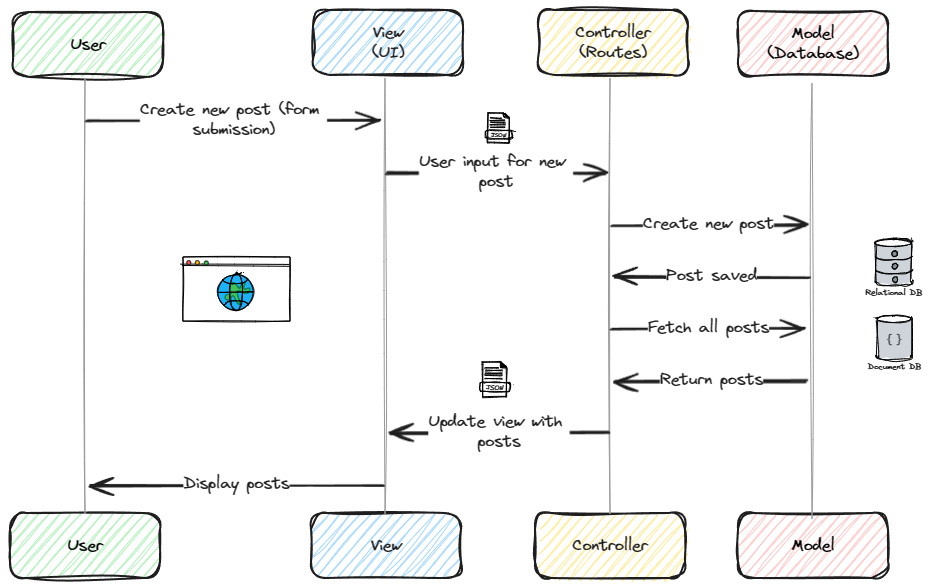

# Model View Controller (MWC)

Structuring your code is important. It helps you to keep your code organized and maintainable. 

One of the most popular ways to structure your code is the **Model View Controller** (MVC) pattern.

## What is MVC?

MVC is mostly about **separation of concerns**. It divides your code into three main components:

- **Model** (Database representation): This is where your data is stored. It represents the data that you are working with. It is responsible for managing the data and the business logic of your application.
    - Each model is a representation of a table in the database.
    - Each model has a set of methods that allow you to interact with the data in the database. (save, fetch, delete, etc.)

- **View** (UI): This is what the user sees. It is responsible for displaying the data to the user. It is the user interface of your application.
    - What the user sees.
    - Decoupled from the model.

- **Controller** (Routes): This is the middleman between the Model and the View. It is responsible for handling the user input and updating the Model and the View accordingly.
    - Connection poing between the model and the view.

## Why use MVC?

- **Separation of concerns**: It helps you to keep your code organized and maintainable. Each component has a specific role and is responsible for a specific part of the application.

- **Reusability**: You can reuse the same model or view in different parts of your application.

- **Scalability**: It makes it easier to scale your application. You can add new features or modify existing ones without affecting the other parts of the application.

- **Testability**: It makes it easier to test your application. You can test each component separately, which makes it easier to find and fix bugs.

## Example

Let's take a simple example to understand how MVC works

Suppose you have a simple application that allows users to create, read, update, and delete posts.

- **Model**: The model will represent the data of the posts. It will have methods to save, fetch, update, and delete posts.

- **View**: The view will display the posts to the user. It will have a form to create a new post and a list of posts.

- **Controller**: The controller will handle the user input. It will have routes to create, read, update, and delete posts. It will update the model and the view accordingly.

Here is how the MVC components will interact with each other:

1. The user creates a new post by filling out a form in the view.

2. The controller receives the user input and creates a new post in the model.

3. The model saves the new post in the database.

4. The controller fetches all the posts from the model.

5. The view displays the list of posts to the user.

This is a simple example of how MVC works. It helps you to keep your code organized and maintainable. It separates the data, the user interface, and the business logic of your application. It makes it easier to scale and test your application. It is a popular pattern used in web development to structure your code.

