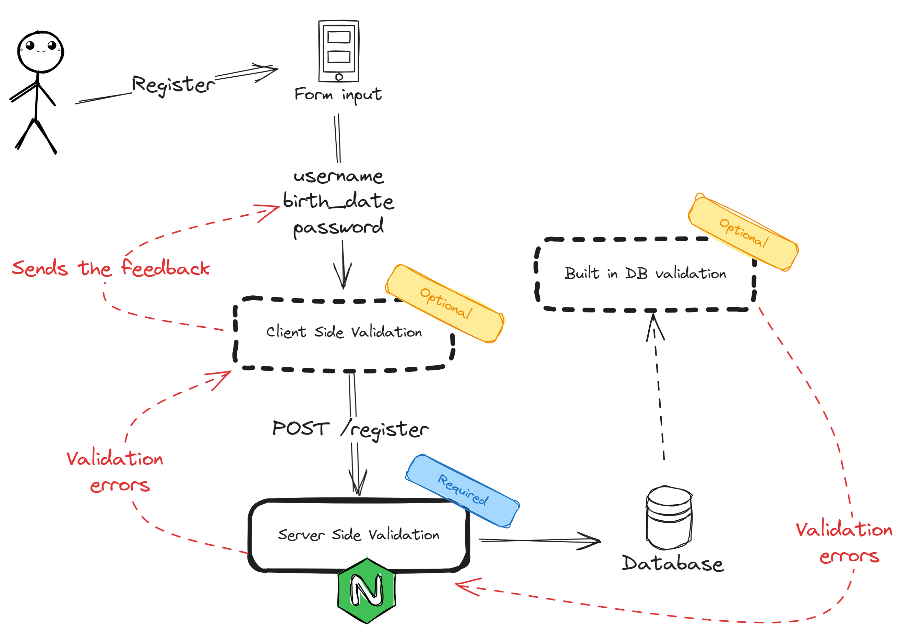

# User Input & Validation in a REST API

## Introduction

In this document, we will discuss the importance of user input validation in REST APIs.

## Why is user input validation important?

User input validation is a crucial part of any application. It ensures that the data entered by the user is accurate, consistent, and secure. 
By implementing user input validation, we also communicate to the consumer of the API what is expected in the request body, query parameters, or headers.

Examples in a e-commerce application: 
- When a user is creating an account, the API should validate the email, password, and other fields to ensure that the data is correct and secure.
- When the user adds a product to the cart, the API should validate the product ID, quantity, and other parameters to ensure that the request is valid.


## When should we validate user input?

 should be performed at the earliest possible stage in the application flow.

User input validation should be performed at the earliest possible stage in the application flow.

- **Client side validation**: This is the first line of defense against invalid data. It can be done using JavaScript in the browser before the request is sent to the server.

- **Server side validation**: Even if client side validation is in place, server side validation is essential to ensure that the data is valid and secure. This is especially important when dealing with sensitive data or when the client-side validation can be bypassed.

- **Built in db constraints**: Database constraints can also be used to enforce data integrity. This can include constraints such as unique keys, foreign keys, and data types.
In some dbs like mongodb, you can also define schema validation rules.

## Setting up validation using Express.js

In Express.js applications you can build your custom validation in your endpoints:

```javascript

app.post('/users', (req, res) => {
  const { name, email, password } = req.body;

  // verification of required fields
  if (!name || !email || !password) {
    return res.status(400).json({ error: 'Missing required fields' });
  }

  // checking if it is a valid email
  if (! /\S+@\S+\.\S+/.test(email)) {
    return res.status(400).json({ error: 'Invalid email' });
  }
  
  // checking if the password has at least 6 characters
  if (password.length < 6) {
    return res.status(400).json({ error: 'Password must have at least 6 characters' });
  }
   

});

```

This approach is simple and effective for basic validation. However, for more complex validation, you can use libraries like `express-validator` or `joi` to define validation schemas and rules.

### Using express-validator

Express Validator is a set of middleware functions that wraps validator.js and provides a simple way to validate user input.

You can check all the available validation methods in the [documentation](https://github.com/validatorjs/validator.js).


```javascript

const { body, validationResult } = require('express-validator');

app.post('/users', 
  body('email').isEmail().custom(async value => {
    const user = await User.findUserByEmail(value);
    if (user) {
      throw new Error('E-mail already in use');
    }
  }),
  body('password').isLength({ min: 6 }),
  (req, res) => {
    const errors = validationResult(req);
    if (!errors.isEmpty()) {
      return res.status(400).json({ errors: errors.array() });
    }
    // Continue with the request
  }
);

```

### Using Joi

```javascript

const Joi = require('joi');

app.post('/users', (req, res) => {
  const schema = Joi.object({
    email: Joi.string().email().required(),
    password: Joi.string().min(6).required()
  });

  const { error } = schema.validate(req.body);
  if (error) {
    return res.status(400).json({ error: error.details[0].message });
  }
  // Continue with the request
});

```

### Using Zod
    
```javascript

const { z } = require('zod');

app.post('/users', (req, res) => {
  const schema = z.object({
    email: z.string().email(),
    password: z.string().min(6)
  });

  try {
    schema.parse(req.body);
    // Continue with the request
  } catch (error) {
    return res.status(400).json({ error: error.errors });
  }
});

```
